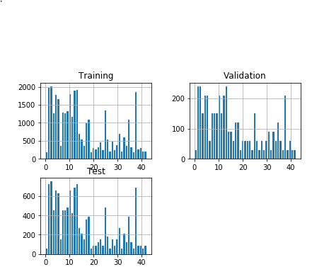
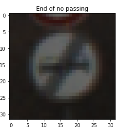
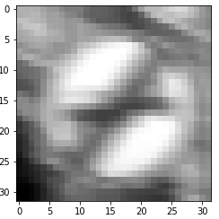
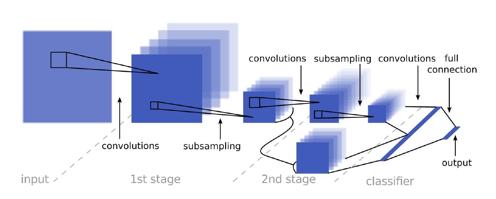

# Project: Build a Traffic Sign Recognition Program

Overview
---
In this project, you will use what you've learned about deep neural networks and convolutional neural networks to classify traffic signs. You will train and validate a model so it can classify traffic sign images using the [German Traffic Sign Dataset](http://benchmark.ini.rub.de/?section=gtsrb&subsection=dataset). After the model is trained, you will then try out your model on images of German traffic signs that you find on the web.


The Project
---
The goals / steps of this project are the following:
* Load the data set
* Explore, summarize and visualize the data set
* Design, train and test a model architecture
* Use the model to make predictions on new images
* Analyze the softmax probabilities of the new images
* Summarize the results with a written report


### Dependencies
This lab requires:

* [CarND Term1 Starter Kit](https://github.com/udacity/CarND-Term1-Starter-Kit)

The lab environment can be created with CarND Term1 Starter Kit. Click [here](https://github.com/udacity/CarND-Term1-Starter-Kit/blob/master/README.md) for the details.

### Dataset and Repository

1. Download the data set. The classroom has a link to the data set in the "Project Instructions" content. This is a pickled dataset in which we've already resized the images to 32x32. It contains a training, validation and test set.
2. Clone the project, which contains the Ipython notebook and the writeup template.
```sh
git clone https://github.com/udacity/CarND-Traffic-Sign-Classifier-Project
cd CarND-Traffic-Sign-Classifier-Project
jupyter notebook Traffic_Sign_Classifier.ipynb
```

---

Writeup
---

**Build a Traffic Sign Recognition Project**

The goals / steps of this project are the following:
* Load the data set (see below for links to the project data set)
* Explore, summarize and visualize the data set
* Design, train and test a model architecture
* Use the model to make predictions on new images
* Analyze the softmax probabilities of the new images
* Summarize the results with a written report


### Dataset Exploration

#### Dataset Summary

I used the pandas library to calculate summary statistics of the traffic signs data set:

* The size of training set is 34799
* The size of the validation set is 4410
* The size of test set is 12630
* The shape of a traffic sign image is (32, 32, 3)
* The number of unique classes/labels in the data set is 43

#### Exploratory Visualization

Here is an exploratory visualization of the data set. 
The two bar chart diagrams show the distribution of the classes within the different datasets.



### Design and Test a Model Architecture

#### Preprocessing 

The input image looks like the following (before preprocessing):



As a first step, I decided to convert the images to grayscale because the RGB format would end in much more features that are unrelevant for the network.
Therefore the network has a hard time trying to classify the image although it could be easier.

Furthermore, the image has been normalized because the neural network can handle normalized data better than unnormalized data (overshooting problems).



#### Model architecture

My final model consisted of the following layers according to the paper "Traffic Sign Recognition with Multi-Scale Convolutional Networks".
Here is a visualization of the network:



The detailled architecture with Padding, Pooling, ReLU, dropout and filtersize are documented in the code. (see ipython or html)

This specific architecture is chosen because it performs under all the tested variations (see below) the best possible. 

Furthermore, as in the above mentioned paper is stated, this architecture fits perfectly for traffic sign recognition.

#### Model Training

To train the model, an AdamOptimizer is used because it performs best among other commonly used optimizers for the MNIST dataset. Therefore, it is chosen and was also the best optimizer tested (without prove here).
Moreover, the learning rate was slightly variated within the rate 0.008 - 0.015 but the best results were performs by the learning 0.001, why it is set to this value.

The number of epochs has be increased to 40 in order to achieve these results, what also increases the training time.

#### Solution Approach

My final model results were:
* training set accuracy of ?
* validation set accuracy of 0.96
* test set accuracy of ?

As a starting point the architecture of the above mentioned paper is used, which works very good out of the box.

Nevertheless, an iterative approach was used to improve the performance of the net further.

For example, a dropout between the ConvNet and the fully connected layers turned out to be very useful.

Several parameters were turned to check whether it provides the possibility to improve the training.
Most of them were tuned fine out of the lecture, but some (for example the epoche size) are doing huge improvements.


### Test a Model on New Images

#### Acquiring New Images

Here are 8 German traffic signs that I found on the web: Folder test_images

These images consists of synthetical images and real images, just to test both. 
But no correlation between real image and wrong classification could be found. 

#### Performance on New Images

The detailed results of the classification can be found in the html file, but the accuracy of the total classification of the test images from the internet was 0.625. 

#### Model Certainty - Softmax Probabilities

The code for making predictions on my final model is located in the 52th cell of the Ipython notebook.

The results are also printed directly into the console of the ipython notebook (or html file).

Most of the times, the model has a very high probability (above 98%), then the predicition is usually correct. 
When the highest probability drops below 94%, it is unlikely that the prediction is really correct.